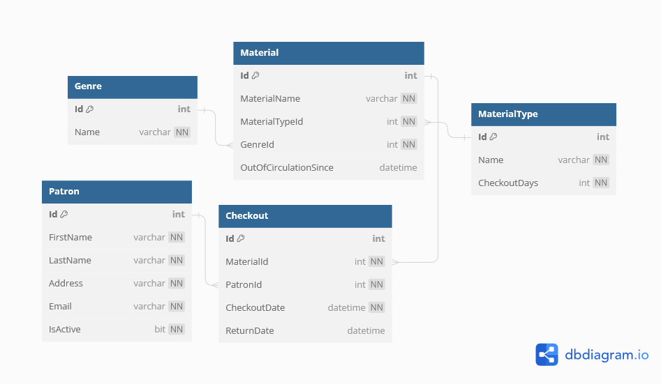

# :book: Loncotes County Library

**Nashville Software School project for Book 3 - SQL & EF Core:**
The Loncotes County Library has hired us to build a new web application to manage their patrons, materials, and checkouts. We will be building the app to be used with their existing database, but you will need to create your own for local development based on the data model of the library's. Eventually, the app will be used by patrons and librarians, but a pilot program for the first version will only be used by the librarians.

This is the ERD for the library's database:
